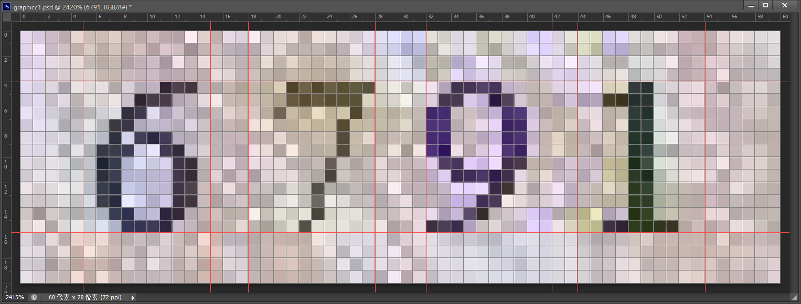
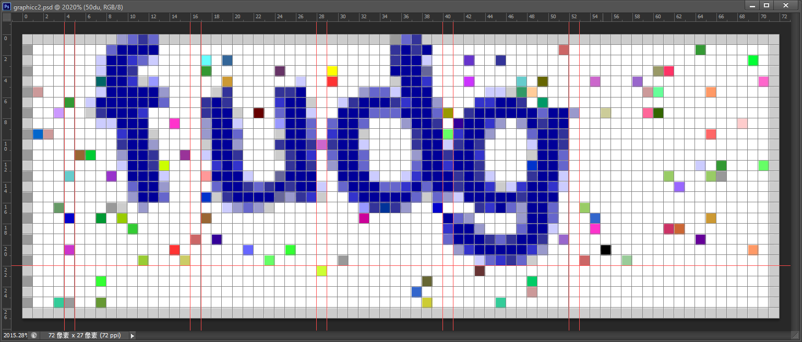

# GraphicCR - 基于 Java 的简单图形验证码识别


### 支持类型

| 类型 | 图形 | 来源 | 识别正确率 |
| :--- | :--- | :--- | :--- |
| 第1类 | [](http://jwpt.neuq.edu.cn/ACTIONVALIDATERANDOMPICTURE.APPPROCESS) | [东北大学秦皇岛分校教务管理系统](http://jwpt.neuq.edu.cn) | 10 / 10 = **100%**，单：40 / 40 = 100% |
| 第2类 | [](http://222.197.143.7/CheckCode.aspx) | [成都医学院教务管理系统](http://222.197.143.7) | 87 / 100 = **87%**，单：386 / 400 = 96.5% |
| 第3类 | [](http://211.70.128.23/JWWEB/sys/ValidateCode.aspx) | [蚌埠医学院教务网络管理系统](http://211.70.128.23/JWWEB/) | 91 / 100 = **91%**，单：389 / 400 = 97% |

图形样本特征分析：
* 第1类  
:smile: 字符数固定  
:smile: 字符亮度一致，阀值 `0.6`  
:smile: 位置基本固定，每个字符具有1~3像素的水平偏移  

* 第2类  
:smile: 字符数固定  
:smile: 字符颜色固定，色值 `#ff000099`  
:smile: 位置基本固定，字符间水平有1像素交集  
:persevere: 字符有旋转  

* 第3类  
:smile: 字符数固定  
:smile: 字符饱和度一致，阀值`0.2`  
:persevere: 位置水平基本固定、垂直漂移  
:persevere: 有随机干扰线  


### 开始使用

* 以 Eclipse 为例，将 `graphiccr-x.x.x.jar` 添加到项目的 `libs` 目录
* 示例代码：
```java
public static void main(String[] args) {
    File testFile1 = new File("E:/JavaWebProjects/SchTtable/reserve/东北大学秦皇岛分校/ImageCode/test/3014.jpg");
    String result1 = GraphicCTranslator.translate(testFile1, GraphicCTranslator.TYPE_1);
    System.out.println(result1);
    
    File testFile2 = new File("E:/JavaWebProjects/SchTtable/reserve/成都医学院/ImageCode/test/2rxl.gif");
    String result2 = GraphicCTranslator.translate(testFile2, GraphicCTranslator.TYPE_2);
    System.out.println(result2);
    
    File testFile3 = new File("E:/JavaWebProjects/SchTtable/reserve/东北大学秦皇岛分校/ImageCode/test/xxxx.jpg");
    String result3 = GraphicCTranslator.translate("http://jwpt.neuq.edu.cn/ACTIONVALIDATERANDOMPICTURE.APPPROCESS",
            testFile3, GraphicCTranslator.TYPE_1);
    System.out.println(result3);
}
```


### 项目应用

* 极课（一款简单的高校课表App）  


### 参考资料

* @problc 的博客：[java验证码识别](http://blog.csdn.net/problc/article/details/5794460)


### 联系作者

* E-mail：[By_syk@163.com](mailto:By_syk@163.com "By_syk")


### License

    Copyright 2016 By_syk

    Licensed under the Apache License, Version 2.0 (the "License");
    you may not use this file except in compliance with the License.
    You may obtain a copy of the License at

       http://www.apache.org/licenses/LICENSE-2.0

    Unless required by applicable law or agreed to in writing, software
    distributed under the License is distributed on an "AS IS" BASIS,
    WITHOUT WARRANTIES OR CONDITIONS OF ANY KIND, either express or implied.
    See the License for the specific language governing permissions and
    limitations under the License.


*Copyright &#169; 2016 By_syk. All rights reserved.*